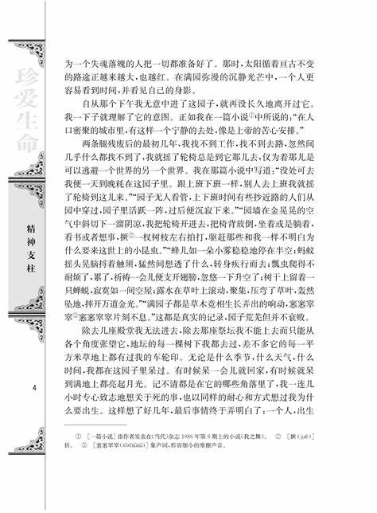

May be I can train an AI to create a person with a long text about my memory with him. I can also record a person's voice,and add it to the model.May the difficult thing is that I do not have a big server(I have no money).I sincerely hope that the old who raised me could accompany me util my death.

In me you may see, at this season of the year, the yellow leaves either stripped off, or in twos and threes.

