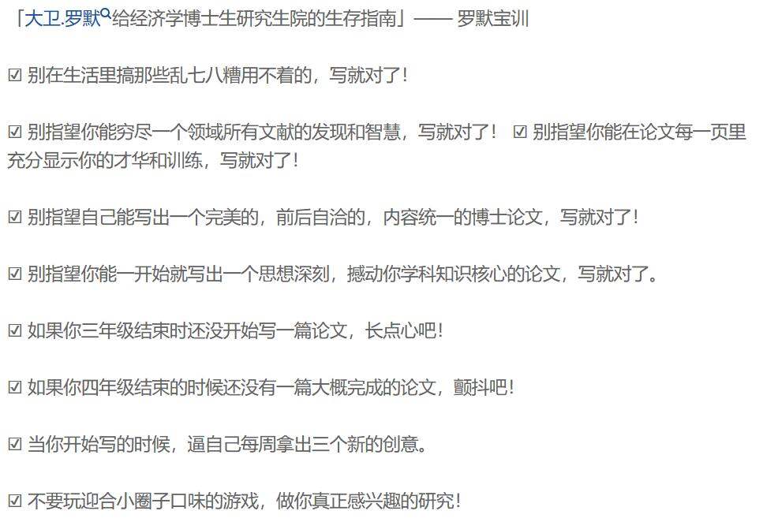

1.养成良好的文献管理习惯：我现在的文献管理宛如一坨...基本上就是一个project一个文件夹里面放文献，最多等写文章的时候往Mendeley或者Endnote里面一扔，或者懒得时候直接Google Scholar Cite。这个方法在开始科研的时候是方便。但是，一旦从事长期的科研工作....就实在跟不上节奏。经常是脑海里有一篇文章的影子，但是想不起来具体的出处，只能重新找，这浪费了我很多的时间。以及现在逐渐开始做一些大的综述，这对于文献的积累就提出了更高的要求。如果可以重读一次：一定会养成良好的文献阅读与管理习惯吧，Endnote、Mendeley、Zotero、Papers用起来，以及一些有意思的[文献分析](https://www.zhihu.com/search?q=%E6%96%87%E7%8C%AE%E5%88%86%E6%9E%90&search_source=Entity&hybrid_search_source=Entity&hybrid_search_extra=%7B%22sourceType%22%3A%22answer%22%2C%22sourceId%22%3A855238064%7D)软件CitreSpace、HistCite啥的也提早学起来。文献永远是博士生最好的朋友。

2.可能的话，尽早到其他学校同专业去看看：不同学校，不同学习环境对一个博士的成长有着举足轻重的影响。到其他学校开会，以及在美国访学这段时间，一个最大的感触就是不能[故步自封](https://www.zhihu.com/search?q=%E6%95%85%E6%AD%A5%E8%87%AA%E5%B0%81&search_source=Entity&hybrid_search_source=Entity&hybrid_search_extra=%7B%22sourceType%22%3A%22answer%22%2C%22sourceId%22%3A855238064%7D)，把自己局限在一个比较狭小的环境中。多和其他优秀的人交流，自己也会有所提升。哪怕什么都没学到，也至少鞭策到了自己。此外，出去看看，还可以增加潜在的合作范围，这对于之后的科研都是大有裨益的。如果可以重读一次：一定多和厉害的人交流，多出去走走，多学多问。

3.最好的学习时间不是ddl，而是提前开始：有很多东西学起来都觉得很费劲，因此在硕士阶段和博一都没有狠下心来学，这就导致了到真正需要使用的时候，没有足够的知识和能力积累。而这不但增加了[ddl](https://www.zhihu.com/search?q=ddl&search_source=Entity&hybrid_search_source=Entity&hybrid_search_extra=%7B%22sourceType%22%3A%22answer%22%2C%22sourceId%22%3A855238064%7D)之前的负担，也对未来潜在的合作带来了负面的影响。如果可以重读一次：LaTex等软件的早点学习；[随机过程](https://www.zhihu.com/search?q=%E9%9A%8F%E6%9C%BA%E8%BF%87%E7%A8%8B&search_source=Entity&hybrid_search_source=Entity&hybrid_search_extra=%7B%22sourceType%22%3A%22answer%22%2C%22sourceId%22%3A855238064%7D)等[数学基础](https://www.zhihu.com/search?q=%E6%95%B0%E5%AD%A6%E5%9F%BA%E7%A1%80&search_source=Entity&hybrid_search_source=Entity&hybrid_search_extra=%7B%22sourceType%22%3A%22answer%22%2C%22sourceId%22%3A855238064%7D)早点打牢，各种编程软件、分析工具尽早熟悉。

4.学习有用的课程，而不是学习要求的课程：学校的很多课程，其实在学完了之后发现并没有很大的帮助。相反，网络上有很多优秀的公开课程，比如Coursera，Mooc或者[B站](https://www.zhihu.com/search?q=B%E7%AB%99&search_source=Entity&hybrid_search_source=Entity&hybrid_search_extra=%7B%22sourceType%22%3A%22answer%22%2C%22sourceId%22%3A855238064%7D)上，都有很多讲的非常通透的老师。如果可以重读一次：确定方向之后尽早开始查漏补缺。

5.尽量精通除英语以外的另一门外语，但其实对人文社科比较有帮助（先把英语搞好，寒假积累日语语料库）。

6.好好运动，早睡早起：很多博士生做完项目大病一场。

7.早点注重PPT（演讲能力），申请书，报告书这些东西的重要性，和paper同等重要。

8.学会人性和高效的团队管理：以学生的角度多观察，当了老师就难看到学生的角度了。

9.学会规范的引用和标注，对可能抄袭的地方缺乏敏感度，容易把自己给坑了。

10.不要做项目，很多博士生因为做项目落了一身病，还会被导师骂。大环境在这里，博士期间，甚至说

教职期间，paper是最重要的。

11.重复上诉观点，读博要选好导师。一个好的导师是你一生的资源，一个坏的导师足以毁掉你的半生。读博一定要快。早点着手博士论文，早点写完，早点毕业，时间就是生命，时间就是职业前途，时间就是事业生命线（ 简在我心 ）

* “所以千万不要相信导师说的‘哪个博士不延期，哪个博士不延期 2 年’的鬼话”（ [工藤正男](https://www.zhihu.com/search?q=%E5%B7%A5%E8%97%A4%E6%AD%A3%E7%94%B7&search_source=Entity&hybrid_search_source=Entity&hybrid_search_extra=%7B%22sourceType%22%3A%22answer%22%2C%22sourceId%22%3A2271406858%7D) ）  

* “完善好我的攻博计划书，入学前专心了解好实验室研究方向，合理安排好自己的时间”

12.所以有功夫写一下读博计划书，不是让你必须按计划书，只不过是前人的痛点你必须有印象。

13.早点让导师陪你搞完一篇论文，然后自己尽早发论文，别想着鳖大刊，有时候做比不做更高效。

    Starting next week I'm going to start blogging in English, for no other reason than that English is always a researcher's best friend.But right now, I have something more important to do, which is to prepare for my CET6.

    When I was a child, I stood on the bed and my grandmother was close to me, she made me pull out her white hair, I was so small at that time that I can't realise my grandmother was old, now, in the university, I stand in the cold wind and look towards the south, I miss my grandparents but I don't regret it, because it is their expectation and I want to live in the moment.My grandma,now,has dyed her hair black.

