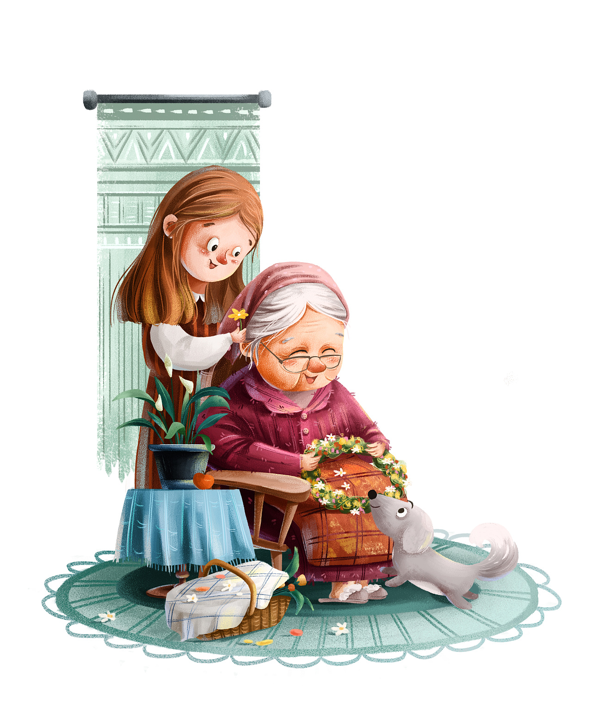
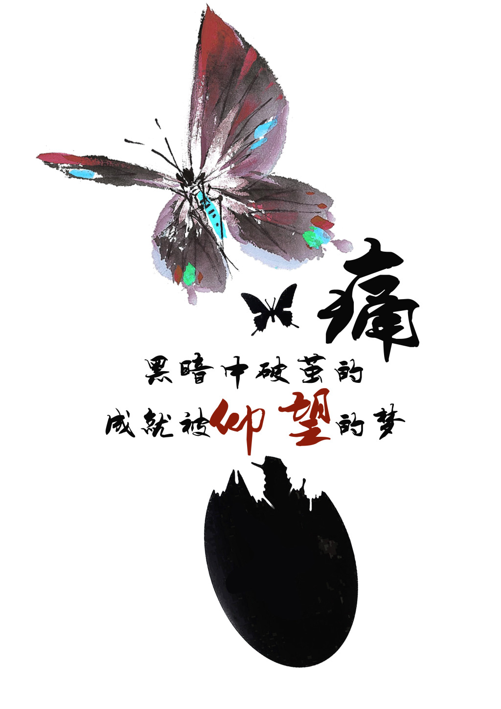

###### Poem

她领着大包小包的东西回头走，哭扯着嗓子喊，小宝--小宝--。她喊，小宝！路人都看着这个皮肤黢黑的胖女人，带着怜悯的目光。突然，她跑向另一个皮肤白皙的白帽子女人，那个女人一手护着孩子，一手打着招呼，在等她。小宝哭着喊，奶奶！奶奶！胖女人激动地跑，蹲下去，把小孩抱起来！白女人说，又不会拐跑了。胖女人听见这话，抡起手就往孩子头上打，让你跟紧，你咋走丢啦！我让你跟紧！让你乱跑！白女人劝道，别打了，他还是孩子，胖女人继续打，小宝哭，大声地哭，嗫嚅着喊，奶奶，奶奶。他哭。一个穿着翻领衬衫，戴着黑框眼镜的中年人，跑上来劝胖女人。别打了，别打了，他还是个孩子。胖女人停手，把小孩放到地上。小孩擦擦眼泪，又嗫嚅，奶奶！奶奶！他张开双手对着胖女人喊。胖女人抱起小宝，带着大包小包的东西，急匆匆地走。她满脸汗，额头在太阳下发光，很快她拐过了路口。人群也散了。

###### Academic📚

这周去找邵老师谈过了，我有留校的意思，等下一年的本博贯通吧。其实在这之前我也想了很多，但我觉得我应该有自己的看法，南航给了我们那么优惠的条件，加上我又蹦着成为纯粹的人而去的（邵老师还说一篇顶刊（本博贯通任教条件）不难）。我就加把劲吧，努力提升自己的文献阅读能力和创新能力。早日能独自发论文！

###### Study🖊

1.这周看了生存分析的综述，但实际上是第一次读论文，感觉掌握的不是很好。在和邵老师讨论的时候就发现我们的理解程度不在一个级别。个人感觉这样的讨论交流没有意义，反而浪费了邵老师的时间。

2.多元统计分析真是一门好课，踏实学好没坏处！

3.自动控制原理为什么总是算错啊。我明明以前很熟练的啊！

4.数据挖掘打算和邵老师商量一下，我不知道要用muti task learning还有哪几种方法对我帮助最大。还是看实现方法的引用量？

5.对计组有点疑问，感觉前3节课还没讲到核心知识，再观望观望。

6.一定要早点睡，一周四节早八啊！你清醒清醒，别迟到了。

7.六级题目刷起来了要。

###### others

这几周是蜕变期，因为第一次感受科研，习惯了就可以慢慢成为科学家🔬了。
