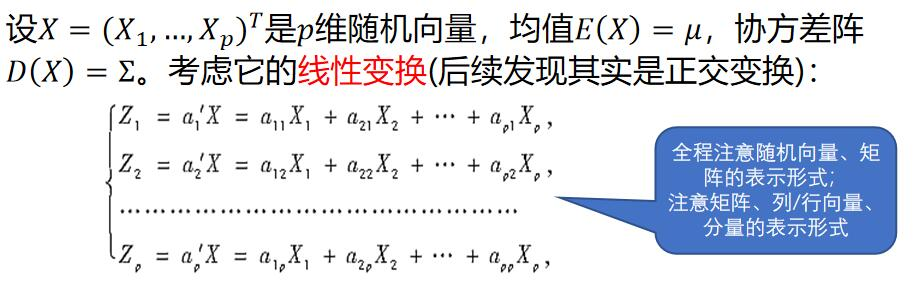
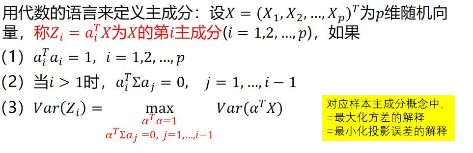
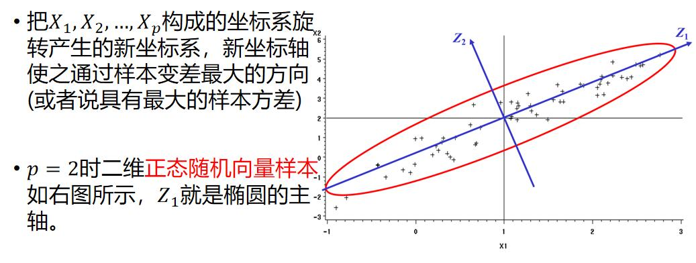
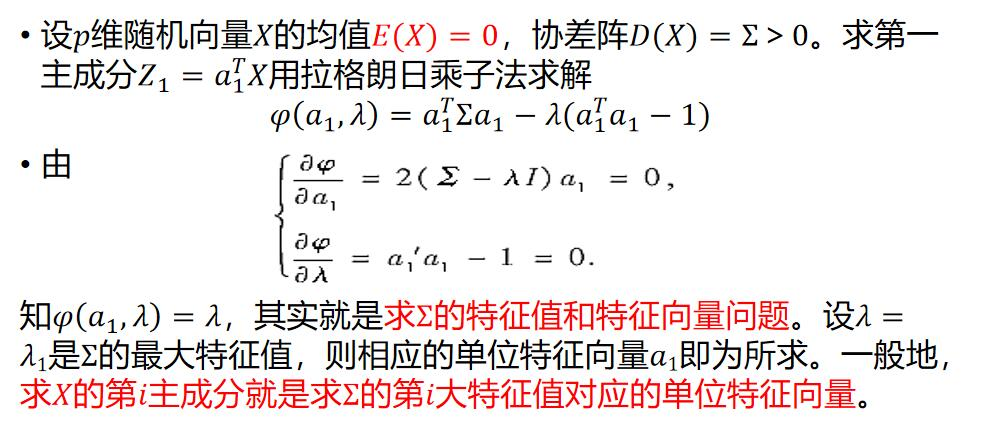
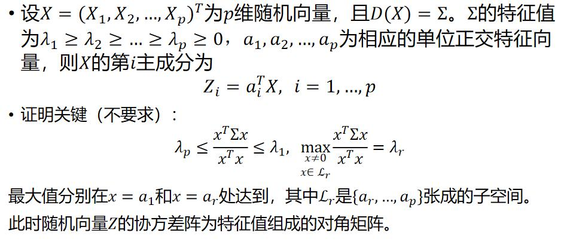
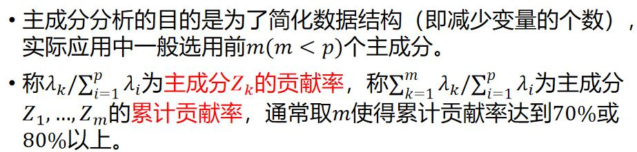
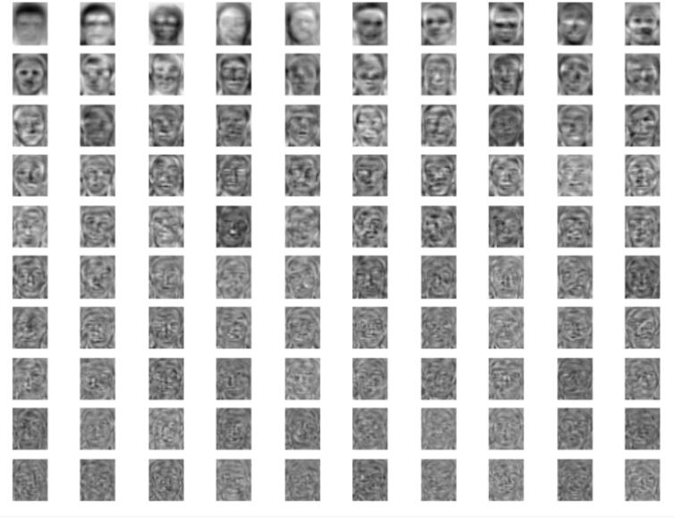

###### PCA介绍

首先，简单介绍一下PCA(主成分分析)，主成分分析是把多指标化为少数几个综合指标的方法（重点在综合二字）。我的多元统计分析李老师说过，由于学校可以接一些企业的项目，而企业人员往往对PCA一无所知，因此，他经常听见这样的描述，”我希望你把这些数据整理一下，这个结果是多变量影响的，你用PCA（主成分分析）整理一下，选出几个占影响程度大的3个变量给我“。当然，这是PCA做不到的。这并不是说我们应该嘲笑这位企业人员，因为他不是这个领域的人，或许搞好人际关系，企业管理你比不过人家呢？李老师给我们举这个例子的原因在于暗示我们，你是专门学这个的，隔行如隔山，你连本领域都没搞清楚，这个PCA的本质都没搞清楚，哪有脸说自己学人工智能的啊。

这里抄一段北京大学《应用多元统计分析》中的PCA开端的话，很透彻。
*主成分分析是把多指标化为少数几个综合指标的方法。在实际问题中，研究多指标的问题是经常遇到的问题。多元统计分析处理的是多变量（多指标）问题，由于变量太多，并且彼此间存在一定的相关性，因而使得所观测到的数据在一定程度上有所重叠。而且当变量较多时，在高维空间研究样本的分布规律比较复杂，势必增加分析问题的复杂性。人们自然希望用较少的综合变量来代替原来较多的变量，而这几个综合变量又尽可能多的反应原来变量的信息，并且彼此之间互不相关。利用这种降维的思想，产生了主成分分析，因子分析，典型相关分析，偏最小二乘回归等统计方法。主成分分析又称为主分量分析或主轴分析。*

你知道随机变量的意思吗？在概率统计中，随机变量（random variable）表示随机试验各种结果的实值单值函数。假设我们掷一枚硬币，那么这枚硬币正面朝上和反面朝上都是可能的结果。如果我们用变量X来表示这枚硬币正面朝上的次数，那么X就是一个随机变量。服从的分布就是独立重复实验，二项分布啦。分布律就是P(X=k)=C(n,k)(1/2)^{k}(1/2)^{n-k}。即随机变量X可以表示各种可能的结果。

那随机向量你也应该很清楚可以明白，没错，就是把随机变量组合成一个列向量，X=(X1,X2...Xp)’就称为p维随机向量，显然X1，X2可能相关，我们就可以通过计算相关系数cov(X1,X2)来探究随机变量之间的相关性，显然D(X)=E(X-E(X)(X-E(X))')是个矩阵，且由于变量和计算对称，该矩阵是对称矩阵，定义为∑。这里举个多元正态分布的例子，X~Np(u,∑)，X为p维随机向量,它满足均值为u(u是p维列向量，一个随机变量一个均值，p个随机变量就是p个均值),协方差矩阵为∑。一维情况：知道均值和方差确定一个一维正态分布，以上知道u和协方差矩阵∑确定了一个p维正态分布，唯一确定。且p维正态分布的线性组合一定是多维正态分布，例如Z=BX+d,B为s×p常数矩阵，d为s维列向量，Z~Ns(Bu+d,B∑B')。

继续回到总体的主成分。

这里常识上理解也是没有问题的，p维随机向量可以转变为另一个p维度随机向量，取特殊矩阵aij=1(if i=j)else=0。那么随机向量Z就等于随机向量X。我们希望通过上面这组没有损失的线性变换找到综合变量Z,要确定Z就要确定系数矩阵a1,a2,ap,p个常数列向量。

我们可以知道Z的一些东西，由于线性变换，故可以先计算出Z中随机变量的协方差。

Var(Zi)=var(ai'X)=(ai')var(X)(ai')'=ai'∑ai

Cov(Zi,Zj)=Cov(ai'X,aj'X)=ai'∑aj

变换后有Var(Z_i)=a_i^TΣa_i，Cov(Z_i,Z_j)=a_i^TΣa_j。经典情况下Var(Zi)表示信息，方差越大，包含信息越多。

假如我们希望用Z_1来代替原来的p个变量，这就要求Z_1尽可能多地反应原来p个变量的信息。但在a_1没有限制的情况下，Var(Z_1)可以是无穷大。因此让在限制条件常数向量成为单位向量，a_1^Ta_1=1下，Var(Z_1)越大，包含的信息越多，此时Z_1就称为第一主成分。
如果第一主成分还不足以代表原来p个变量的绝大部分信息，需要继续引入第二主成分Z_2——但Z_1已体现的信息不希望在Z_2中出现，也就是Cov(Z_1,Z_2)=0。于是求Z_2就是在条件a_2^Ta_2=1、a_1^TΣa_2=0时求a_2使Var(Z_2)达到最大。以上就是代数语言。当然西瓜书中PCA证明过，最大化方差和最小化投影误差是等价的。

根据线性代数的几何意义，我们清楚的明白主成分分析的几何意义如下。

讲到这里，聪明的我不需要证明，直接根据直觉就明白了矩阵正交对角化是解决问题的关键。因为矩阵正交对角化的实质就是向正交向量上投影，Cov(Zi,Zj)=Cov(ai'X,aj'X)=ai'∑aj=0，只要∑对角化后，那么投影后的各个变量都是独立的，方差就是特征值，方差越大，该成分越好。

但是，直觉虽好，但需要证明。

证明关键在于有约束问题的拉格朗日乘子法，求导后代回去，发现最大化方差，就是最大化特征值。Z1就对应最大的特征值。当然，还有一种方法是通过广义瑞利熵证明的。

主成分分析的目的是为了简化数据结构（即减少变量的个数），实际应用中一般选用前m(m<p)个主成分，达到高贡献率为止。

现在讲到这，就发现特征脸法的论文似乎没什么创新点，唯一的创新点在于大胆的将方法用于人脸识别。

以下是前100个特征值的特征向量，是新的坐标系，具体见上传项目。

[PCA_face源码链接]([hanyangwei-dot/PCA_face (github.com)](https://github.com/hanyangwei-dot/PCA_face))
